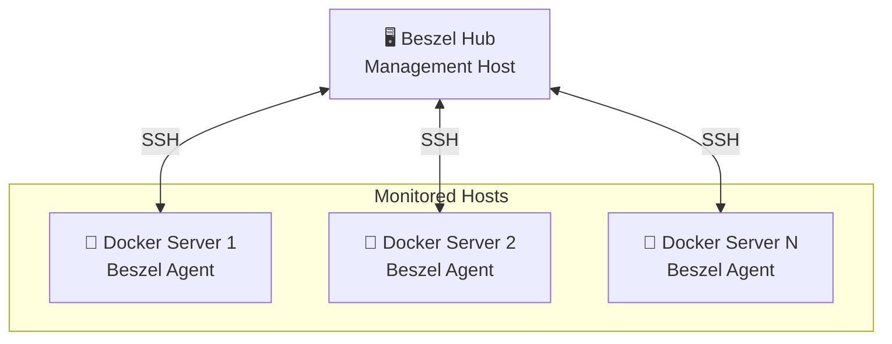

## Monitoring

La struttura è monitorata tramite **Beszel**.

- Beszel Hub: mainArch.
- Beszel Agent: gira su ogni nodo con docker.

```mermaid
flowchart TB
    HUB["🖥️ Beszel Hub<br/>Management Host"]

    subgraph Hosts["Monitored Hosts"]
        A1["🐳 Docker Server 1<br/>Beszel Agent"]
        A2["🐳 Docker Server 2<br/>Beszel Agent"]
        AN["🐳 Docker Server N<br/>Beszel Agent"]
    end

    HUB <-->|SSH| A1
    HUB <-->|SSH| A2
    HUB <-->|SSH| AN
```
